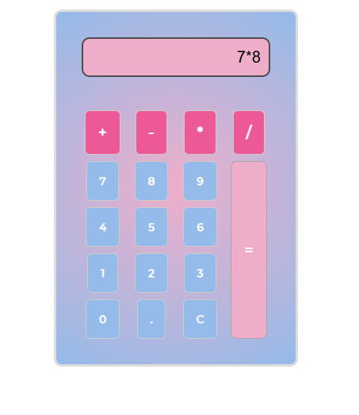
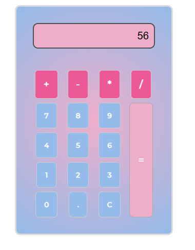

<h1 align="center" style="font-weight: bold;">Calculadora em JS🔢</h1>
<b>Calculadora em JavaScript puro, capaz de realizar operações básicas como soma, subtração, multiplicação e divisão.</b> 

<h2 id="layout">🎨 Layout</h2> 

  
 
     
    
  

 <h2 id="technologies">💻 Tecnologias</h2>
- HTML 
- CSS 
- JavaScript 

<h2 id="learning">📚 Aprendizados</h2>

Este é um projeto simples, desenvolvido com o objetivo de aprimorar meus conhecimentos em manipulação do DOM e tratamento de eventos em JavaScript. Foram utilizados métodos como addEventListener para capturar a interação do usuário, tanto na seleção dos números quanto dos operadores.

O código conta com três funções principais: uma responsável por registrar os números digitados, outra para limpar o display e uma função central que realiza o cálculo. Essa função principal inclui validações por meio de expressões regulares (RegEx) para identificar os operadores e utiliza uma estrutura switch case para executar a operação correspondente.

O resultado final é exibido no display da calculadora.
Apesar de ser um projeto básico e com layout simples, foi uma excelente oportunidade para compreender melhor a integração entre HTML, CSS e JavaScript, bem como a lógica e a estrutura necessárias para criar uma aplicação interativa.

# 🧲 Ferramentas Utilizados

- Visual Studio Code
- https://www.youtube.com/watch?v=42TShjXR0m0
- https://www.freecodecamp.org/portuguese/news/como-construir-uma-calculadora-html-do-zero-usando-javascript/

