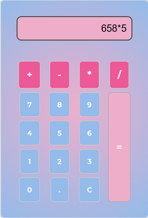

<h1 align="center" style="font-weight: bold;">Calculadora em JS🔢</h1>
<b>Calculadora simples desenvolvida em JavaScript puro, capaz de realizar operações básicas como soma, subtração, multiplicação e divisão.</b> 

<h2 id="layout">🨠Layout</h2> 

  
 
     
    
  

 <h2 id="technologies">💻 Tecnologias</h2>
- HTML 
- CSS 
- JavaScript 

<h2 id="learning">📚 Aprendizados</h2>

É um projetinho basico sem muito layout, a ideia era aprimorar mconhecimentos em manipulação do DOM, tratamento de eventos que foi utilizado o addEventListener para selecionar os numeros e um outro para os operadores,
foi criado três funções em JavaScript uma pra selecionar os numeros, outra pra limpar e, sobretudo, uma função principal que gera o calculo. Ela foi responsavel por criar validaçoes utilizando da estrutura do REGEX para selecionar os operadores,
e para a operação final dos numeros uma estrutura de SWITCH CASA para cada tipo de operação. 
Gerando o resultado no display da calculadora.

Foi uma ótima oportunidade para entender a dinâmica entre HTML, CSS e JavaScript em uma aplicação com interatividade mesmo que seja um projeto simples, foi importante entender a lógica por tras e a estrutura dessas tecnologias em conjunto.

# 🧲 Ferramentas Utilizados

- Visual Studio Code
- https://www.youtube.com/watch?v=42TShjXR0m0
- https://www.freecodecamp.org/portuguese/news/como-construir-uma-calculadora-html-do-zero-usando-javascript/

